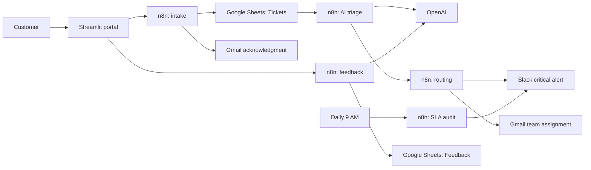

# AI Customer Support Automation Platform

A capstone implementation of an AI-assisted support operation. Customers submit tickets in a Streamlit portal; n8n registers, classifies, routes, monitors, and analyzes those tickets using OpenAI, Google Sheets, Gmail, and Slack.

## 1. Problem analysis

### Business context

Growing software companies receive support requests through email, web forms, chat, and social platforms. A manual support desk cannot consistently decide urgency, prevent requests from being overlooked, or provide timely updates at scale.

### Stakeholders and pain points

| Stakeholder | Need | Current pain |
|---|---|---|
| Customers | Fast acknowledgement and accurate resolution | Slow and inconsistent replies |
| Support agents | Clear queue and ownership | Manual sorting and duplicate effort |
| Engineering/Billing teams | Relevant, urgent escalations | Critical issues arrive late or incomplete |
| Support manager | SLA visibility and trends | No reliable operational reporting |

### Objectives and success measures

- Register every web ticket with a unique ID and acknowledgment email.
- Use AI to produce a category, priority, rationale, and destination team.
- Alert Slack for critical issues and forward work to the appropriate team.
- Surface open tickets older than 24 hours every morning at 9 AM.
- Capture feedback and sentiment to identify recurring themes.

Suggested KPIs: first-response time, average resolution time, SLA breach count, priority distribution, CSAT rating, negative-feedback rate, and top issue themes.

## 2. Architecture



### Data model

Create a Google Spreadsheet with two tabs.

**Tickets** (use these headers exactly): `Ticket ID`, `Name`, `Email`, `Category`, `Description`, `Status`, `Priority`, `Created At`, `Assigned Team`, `AI Rationale`.

**Feedback**: `Ticket ID`, `Rating`, `Comments`, `Sentiment`, `Theme`, `Action Required`, `Received At`.

## 3. Workflow inventory (25 nodes)

| # | Workflow | Nodes | Purpose |
|---|---|---:|---|
| 1 | Ticket Collection & Ingestion | 4 | Receive a ticket, normalize it, create its register entry, and acknowledge it. |
| 2 | AI Classification & Priority Triage | 5 | Detect new rows, ask OpenAI for structured triage, parse it, evaluate urgency, and update the row. |
| 3 | Smart Escalation & Routing | 5 | Route priority/category, alert Slack for critical incidents, forward to a team, and return a result. |
| 4 | Daily SLA & Overdue Ticket Audit | 5 | Run daily, read tickets, identify open tickets over 24 hours, summarize them, and notify managers. |
| 5 | Feedback & Sentiment Processing | 6 | Receive feedback, analyze sentiment, log it, wait briefly, send thanks, and confirm receipt. |

### Import and configure the n8n JSON files

1. In n8n, create credentials for Google Sheets OAuth2, Gmail OAuth2, Slack OAuth2, and OpenAI.
2. Import each file from [`workflows`](workflows). Open every node carrying `REPLACE_...` and choose its real credential, Spreadsheet ID, or Slack channel.
3. Workflow 1 publishes `POST /webhook/support-ticket`; Workflow 3 publishes `POST /webhook/route-ticket`; Workflow 5 publishes `POST /webhook/ticket-feedback`.
4. Activate workflow 1, then workflow 2, 4, and 5. Run workflow 3 through an **Execute Workflow** node after `Update Triage Fields`, or invoke its webhook from that step with an HTTP Request node. This keeps routing reusable across future channels such as Gmail or a chatbot.
5. Use a low-privilege Google account for this project and never place API keys in workflow JSON or source control.

### Important configuration notes

- The OpenAI nodes instruct the model to return JSON. Keep the `gpt-4o-mini` model or select another enabled low-cost structured-output model.
- In workflow 5, look up the ticket's customer email before the Gmail node (or include `email` in the feedback request) so the thank-you email has a valid recipient.
- The AI workflow triggers when a row is added. For a production database, replace the spreadsheet trigger with a queue or database event to avoid polling limits.
- The status tab calls `POST /webhook/ticket-status`. Add a small status-lookup endpoint in n8n for deployment: Webhook → Google Sheets Read/Filter by Ticket ID or Email → Respond to Webhook. It is intentionally separated from the five assessed automation workflows to preserve the required 25-node architecture.

## 4. Local setup

### Prerequisites

- Python 3.10 or newer
- An n8n instance (n8n Cloud or self-hosted)
- Connected Google, Gmail, Slack, and OpenAI accounts

### Run the portal

```bash
python -m venv .venv
# Windows PowerShell
.venv\Scripts\Activate.ps1
pip install -r requirements.txt
Copy-Item .env.example .env
streamlit run app.py
```

Edit `.env` and set `N8N_WEBHOOK_BASE_URL` to the **production** n8n webhook base URL. The n8n editor's test URL uses `/webhook-test/` and only works while listening for a test event.

`app.py` loads the local `.env` file automatically through `python-dotenv`, so no separate PowerShell environment-variable command is required.

The app has defensive HTTP handling for timeouts, connection failures, non-success status codes, malformed JSON, and unconfigured placeholder URLs.

## 5. Test plan

1. Submit a technical ticket. Verify a Tickets row and acknowledgment email.
2. Submit a data-loss or outage description. Verify OpenAI returns `Critical`, then verify the Slack alert and team email.
3. Change a ticket's `Created At` to over 24 hours ago while its status remains Open. Execute workflow 4 and verify the manager digest.
4. Submit a 1-star feedback response mentioning slow support. Verify negative sentiment, action-required flag, Feedback row, and thank-you message.
5. Test an invalid webhook URL in `.env`; verify that the UI displays a helpful error instead of crashing.

## 6. Repository map

```
app.py                         Streamlit customer portal
workflows/01-...json           Five importable n8n workflow templates
README.md                      Architecture and setup guide
presentation-outline.md        11-slide presentation content
demo-video-script.md           7–8 minute demo narration
requirements.txt               Python dependencies
.env.example                   Safe webhook configuration template
```
