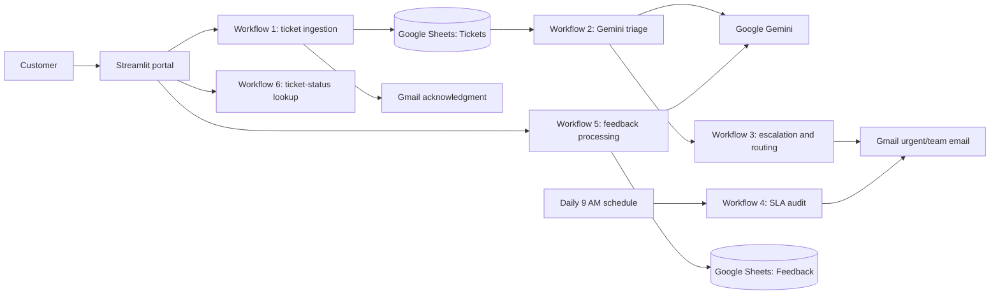

# SupportFlow AI

An AI-powered customer-support automation platform built with **Streamlit**, **n8n**, **Google Gemini**, **Google Sheets**, and **Gmail**. It receives support requests, classifies their urgency, routes them to the right team, monitors SLA risk, and captures customer feedback.

> For the node-by-node technical design, payload contracts, and workflow diagrams, see the [Workflow Documentation](docs/workflow-documentation.md).

## What it solves

Manual ticket handling creates slow responses, inconsistent priority decisions, missed escalations, and limited visibility into recurring customer problems. SupportFlow AI creates a repeatable workflow from customer request through follow-up.

## Key capabilities

- Customer portal to submit tickets, check ticket status, and send feedback
- Automatic ticket registration and acknowledgment email
- Gemini-powered category, priority, team, and rationale classification
- Urgent email escalation for critical tickets
- Daily SLA audit for open tickets older than 24 hours
- Feedback sentiment analysis and service-improvement logging

## Architecture



## Project structure

```text
app.py                  Streamlit customer portal
workflows/              Importable n8n workflow JSON files
docs/                   Detailed technical workflow documentation
.env.example            Local webhook configuration template
requirements.txt        Python dependencies
```

## Requirements

- Python 3.10+
- Docker Desktop and a local n8n instance
- Google account for Google Sheets and Gmail
- Google Gemini API key

## Quick start

### 1. Start n8n

Start your Docker-hosted n8n instance and open:

```text
http://localhost:5678
```

### 2. Configure the Streamlit app

```powershell
python -m venv .venv
.venv\Scripts\Activate.ps1
pip install -r requirements.txt
Copy-Item .env.example .env
```

Edit `.env`:

```env
N8N_WEBHOOK_BASE_URL=http://localhost:5678/webhook
```

Run the portal:

```powershell
streamlit run app.py
```

`app.py` loads `.env` automatically. Do not commit `.env`; it is excluded by `.gitignore`.

## Google Sheets setup

Create one spreadsheet with these two tabs. Header names must match exactly.

### `Tickets`

| Ticket ID | Name | Email | Category | Description | Status | Priority | Created At | Assigned Team | AI Rationale |
|---|---|---|---|---|---|---|---|---|---|

### `Feedback`

| Ticket ID | Rating | Comments | Sentiment | Theme | Action Required | Received At |
|---|---|---|---|---|---|---|

Copy the spreadsheet ID from the URL:

```text
https://docs.google.com/spreadsheets/d/SPREADSHEET_ID/edit
```

## n8n workflows

Import all JSON files in the [`workflows`](workflows) folder. Replace every `REPLACE_...` value with your own credential, spreadsheet ID, email address, or channel value before activating a workflow.

| Workflow | Trigger | Purpose |
|---|---|---|
| 01 — Ticket Collection & Ingestion | `POST /webhook/support-ticket` | Registers a ticket and sends acknowledgment email. |
| 02 — AI Classification & Priority Triage | New Google Sheets row | Gemini classifies category, priority, team, and rationale. |
| 03 — Smart Escalation & Routing | `POST /webhook/route-ticket` | Sends urgent email for critical tickets; forwards others to the team. |
| 04 — Daily SLA & Overdue Ticket Audit | Daily at 9 AM | Identifies open tickets older than 24 hours. |
| 05 — Feedback & Sentiment Processing | `POST /webhook/ticket-feedback` | Uses Gemini to evaluate sentiment and logs feedback. |
| 06 — Check Ticket Status | `POST /webhook/ticket-status` | Finds a ticket by ticket ID or customer email. |

### Required n8n credentials

- **Google Sheets OAuth2** — used by Workflows 1, 2, 4, 5, and 6
- **Gmail OAuth2** — used by Workflows 1, 3, and 5
- **Google Gemini API** — used by Workflows 2 and 5

### Connect Workflow 2 to Workflow 3

Workflow 3 is reusable and exposes its own webhook. After `Update Triage Fields` in Workflow 2, add an **HTTP Request** node:

```text
Method: POST
URL: http://localhost:5678/webhook/route-ticket
```

Send a JSON body containing the ticket details:

```json
{
  "ticketId": "={{ $json['Ticket ID'] }}",
  "name": "={{ $json.Name }}",
  "email": "={{ $json.Email }}",
  "category": "={{ $json.category }}",
  "priority": "={{ $json.priority }}",
  "description": "={{ $json.Description }}"
}
```

In Workflow 3, set its Webhook node response mode to **Using ‘Respond to Webhook’ Node**, then replace `critical-support@yourcompany.com` with your team’s actual email address.

## Test the platform

1. Activate Workflow 1, then submit a ticket in Streamlit.
2. Confirm a row appears in the `Tickets` tab and the acknowledgment email arrives.
3. Activate Workflow 2. Submit a ticket that mentions an outage or production failure; confirm Gemini marks it `Critical`.
4. Activate Workflow 3 and confirm the urgent escalation email reaches your configured team address.
5. Activate Workflow 5 and submit feedback from the portal; confirm the Feedback tab is populated.
6. Activate Workflow 6 and use the status tab with a ticket ID or email.

For local development, always use the **production webhook URL** (`/webhook/...`) after activating the workflow. The test endpoint (`/webhook-test/...`) only works while n8n is listening for a manual test run.

## Security

- Keep API keys, OAuth tokens, and production URLs in `.env` or n8n Credentials—not source files.
- `.env`, `.venv`, Python cache, and Streamlit secrets are excluded from Git.
- Use least-privilege credentials and replace demo recipient addresses before deployment.

## Future improvements

- Replace Google Sheets with PostgreSQL for higher ticket volume
- Add duplicate-ticket detection
- Add email, chatbot, and social-media intake channels
- Add a manager dashboard for SLA, CSAT, and recurring issue trends
