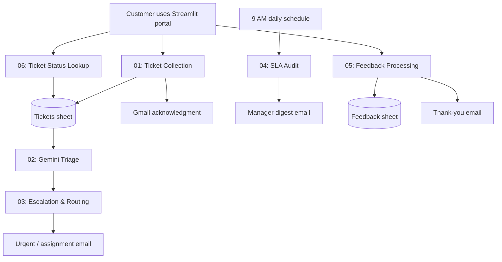
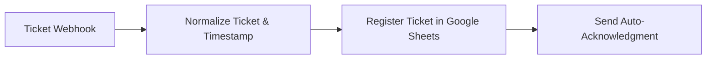
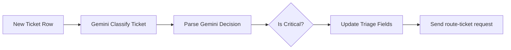
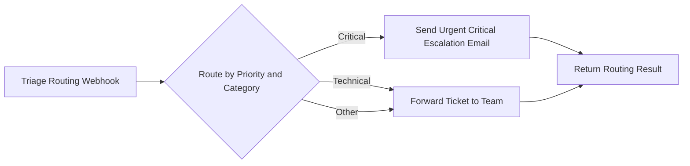
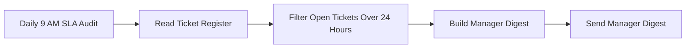
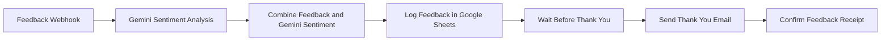
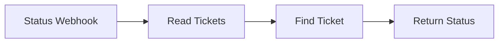

# Workflow Documentation

This document describes the technical design of the n8n automation layer used by SupportFlow AI. It is intended for developers, reviewers, and maintainers who need to configure, test, or extend the workflows.

## Automation overview



## Shared data contract

### Ticket payload

The Streamlit app posts this JSON structure to `support-ticket`:

```json
{
  "ticketId": "SUP-AB12CD34",
  "name": "Customer Name",
  "email": "customer@example.com",
  "category": "Technical issue",
  "description": "The dashboard is unavailable.",
  "status": "Open",
  "submittedAt": "2026-08-07T10:15:00+00:00",
  "source": "Streamlit Web App"
}
```

### Ticket sheet columns

| Column | Source / owner |
|---|---|
| Ticket ID | Streamlit app |
| Name | Streamlit app |
| Email | Streamlit app |
| Category | Customer input, then Gemini triage update |
| Description | Streamlit app |
| Status | Ingestion and triage workflows |
| Priority | Gemini triage |
| Created At | Ingestion workflow |
| Assigned Team | Gemini triage |
| AI Rationale | Gemini triage |

### Feedback payload

```json
{
  "ticketId": "SUP-AB12CD34",
  "rating": 4,
  "comments": "The issue was resolved quickly.",
  "submittedAt": "2026-08-07T11:00:00+00:00"
}
```

## Workflow 01 — Ticket Collection & Ingestion

**File:** `workflows/01-ticket-collection-ingestion.json`  
**Trigger:** `POST /webhook/support-ticket`



| Node | Function | Configuration notes |
|---|---|---|
| Ticket Webhook | Accepts the Streamlit ticket JSON | Use production URL after activating the workflow. |
| Normalize Ticket & Timestamp | Adds default status, initial priority, and timestamp | Keeps incoming fields intact. |
| Register Ticket in Google Sheets | Appends the ticket to `Tickets` | Set Spreadsheet ID and Google Sheets credential. |
| Send Auto-Acknowledgment | Sends receipt confirmation | Set Gmail credential and authorized sender email. |

**Expected result:** a new ticket row and a customer acknowledgment email.

## Workflow 02 — AI Classification & Priority Triage

**File:** `workflows/02-ai-classification-priority-triage.json`  
**Trigger:** New row in the `Tickets` sheet



Gemini must return JSON with this schema:

```json
{
  "category": "Technical",
  "priority": "High",
  "rationale": "Production service is unavailable to multiple users.",
  "team": "Engineering"
}
```

| Node | Function | Configuration notes |
|---|---|---|
| Google Sheets Trigger | Detects a newly registered ticket | Connect it to the `Tickets` tab. |
| Google Gemini | Produces structured classification | Use a Google Gemini API credential and a JSON-capable model. |
| Parse Gemini Decision | Converts Gemini response text to fields | Keep the JSON-only system instruction. |
| Is Critical? | Separates critical priority from other tickets | Condition: `priority` equals `Critical`. |
| Update Triage Fields | Updates category, priority, team, rationale, and status | Match the row by `Ticket ID`. |

### Connect triage to routing

After `Update Triage Fields`, add an **HTTP Request** node that posts to Workflow 3:

```text
Method: POST
URL: http://localhost:5678/webhook/route-ticket
```

```json
{
  "ticketId": "={{ $json['Ticket ID'] }}",
  "name": "={{ $json.Name }}",
  "email": "={{ $json.Email }}",
  "category": "={{ $json.category }}",
  "priority": "={{ $json.priority }}",
  "description": "={{ $json.Description }}"
}
```

## Workflow 03 — Smart Escalation & Routing

**File:** `workflows/03-smart-escalation-routing.json`  
**Trigger:** `POST /webhook/route-ticket`



| Route | Action |
|---|---|
| `Critical` priority | Sends an urgent email to the critical-support team. |
| `Technical` category | Sends the ticket to the configured team address. |
| Other categories | Uses the fallback team-forwarding email path. |

**Required setup**

1. Replace `critical-support@yourcompany.com` with the real escalation recipient.
2. Assign the Gmail OAuth2 credential to both email nodes.
3. Set the Webhook node response mode to **Using ‘Respond to Webhook’ Node**.
4. Activate the workflow before calling `/webhook/route-ticket`.

## Workflow 04 — Daily SLA & Overdue Ticket Audit

**File:** `workflows/04-daily-sla-overdue-audit.json`  
**Trigger:** Daily schedule at 9:00 AM



The filter selects tickets that are in an open working state and whose `Created At` value is more than 24 hours old. The digest contains ticket ID, priority, assignment, and description.

Set the n8n instance timezone correctly so the 9:00 AM schedule matches your local support hours.

## Workflow 05 — Feedback & Sentiment Processing

**File:** `workflows/05-feedback-sentiment-processing.json`  
**Trigger:** `POST /webhook/ticket-feedback`



Gemini returns:

```json
{
  "sentiment": "Positive",
  "theme": "Resolution speed",
  "actionRequired": false
}
```

The result is appended to the `Feedback` sheet. Ensure the workflow has access to the customer email before the thank-you Gmail node runs.

## Workflow 06 — Check Ticket Status

**File:** `workflows/06-check-Ticket-Status.json`  
**Trigger:** `POST /webhook/ticket-status`



The Streamlit portal sends either a ticket ID or email address under `identifier`. The workflow reads the `Tickets` tab, finds the matching ticket, and returns its status to the portal.

## Deployment checklist

- [ ] Create the `Tickets` and `Feedback` Google Sheets tabs with exact headers.
- [ ] Configure Google Sheets, Gmail, and Gemini credentials.
- [ ] Replace all `REPLACE_...` placeholders.
- [ ] Replace demonstration email recipients with team email addresses.
- [ ] Activate all workflows.
- [ ] Add the HTTP Request handoff from Workflow 2 to Workflow 3.
- [ ] Set `.env` to `N8N_WEBHOOK_BASE_URL=http://localhost:5678/webhook` for local Docker use.
- [ ] Submit one normal ticket, one critical ticket, and one feedback form as an end-to-end test.

## Troubleshooting

| Symptom | Check |
|---|---|
| Streamlit reports connection failure | Confirm Docker n8n is running at `http://localhost:5678` and the webhook workflow is active. |
| Workflow does not receive the request | Use `/webhook/...` after activating; `/webhook-test/...` is only for manual testing. |
| Gmail node fails | Reconnect Gmail OAuth2 and verify the sender address is authorized. |
| Gemini node fails | Verify the Google Gemini API key/credential and selected model. |
| No urgent email | Confirm Workflow 2 posts to `/webhook/route-ticket`, Workflow 3 is active, and priority is exactly `Critical`. |
